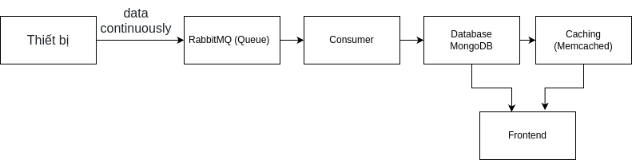

# 📝 Giới Thiệu
Hệ thống API sử dụng Django REST Framework (DRF) để thu thập và quản lý các chỉ số sức khỏe như huyết áp, đường huyết. Hệ thống hỗ trợ RabbitMQ để xử lý dữ liệu bất đồng bộ thông qua hàng đợi tin nhắn (message queue).

## ✨ Tính Năng Đã Triển Khai
### 1. Đăng ký, đăng nhập, authentication
- Hỗ trợ JWT authentication bằng simplejwt.
- Người dùng có thể đăng ký, đăng nhập để quản lý thông tin cá nhân.

### 2. Quản lý người dùng
- CRUD (Thêm, Xóa, Sửa) thông tin người dùng.
- Hỗ trợ **soft delete** và **hard delete** khi xóa người dùng.
    - **Soft delete**: Khi xóa người dùng bằng soft delete, thông tin của người dùng sẽ không bị xóa hoàn toàn khỏi cơ sở dữ liệu. Thay vào đó, trường is_active sẽ được cập nhật để chỉ ra rằng người dùng đã bị xóa. Điều này cho phép khôi phục lại người dùng nếu cần thiết.
    - **Hard delete**: Khi xóa người dùng bằng hard delete, thông tin của người dùng và thông tin sức khỏe sẽ bị xóa hoàn toàn khỏi cơ sở dữ liệu và không thể khôi phục lại được.

### 3. Quản lý chỉ số sức khỏe
- **CRUD** (Tạo, Đọc, Cập nhật, Xóa) dữ liệu huyết áp.
- Mỗi người dùng chỉ có thể truy cập dữ liệu của mình.
- Sử dụng **ViewSet** thay vì các phương pháp khác vì ViewSet cung cấp tất cả các hành động CRUD trong một lớp duy nhất để tận dụng đầy đủ API CRUD.

### 4. Xử lý bất đồng bộ với RabbitMQ
- Khi người dùng tạo mới/cập nhật dữ liệu huyết áp, hệ thống sẽ gửi **message** đến **RabbitMQ**.
- **Hàng đợi `blood_pressure_queue`** lưu trữ thông tin để các dịch vụ khác có thể xử lý sau.
- Consumer (Celery worker) sẽ nhận và xử lý dữ liệu từ queue.



Lý do sử dụng RabbitMQ: hệ thống thu thập chỉ số sức khỏe, dữ liệu từ thiết bị gửi về liên tục, nếu ghi thẳng vào database có thể gây quá tải và ảnh hưởng đến hiệu suất. Vì vậy, RabbitMQ được sử dụng để Giảm tải cho Database, Bảo toàn tính toàn vẹn dữ liệu và Chống mất dữ liệu.

### 5. Cơ sở dữ liệu
- **MySQL** để lưu trữ thông tin người dùng.
- **MongoDB** để lưu trữ dữ liệu chỉ số sức khỏe.

---

## 📌 Hướng Dẫn Cài Đặt & Chạy Hệ Thống

### 1️⃣ Cài đặt Python và Virtual Environment
```sh
python3 -m venv venv
source venv/bin/activate
pip install -r requirements.txt
```

### 2️⃣ Cấu hình RabbitMQ
Chạy RabbitMQ bằng Docker:
```sh
docker run -d --name rabbitmq \
    -p 5672:5672 -p 15672:15672 \
    -e RABBITMQ_DEFAULT_USER=guest \
    -e RABBITMQ_DEFAULT_PASS=guest \
    rabbitmq:3-management
```

Truy cập **RabbitMQ Management**: [http://localhost:15672](http://localhost:15672)
- **Username**: admin
- **Password**: admin

### 3️⃣ Chạy Celery Worker
```sh
celery -A health_metrics_collector worker --loglevel=info -c 4
```
Lệnh này chạy với 4 woker
### 4️⃣ Chạy server Django
```sh
python manage.py migrate  # Khởi tạo database
python manage.py runserver
```

#### Link Swagger: http://127.0.0.1:8000/api/swagger
---

## 📌 Ví Dụ API

### 1️⃣ Thêm dữ liệu huyết áp (gửi message đến RabbitMQ)
#### Request:
```http
POST /api/blood-pressure/
Content-Type: application/json
Authorization: Bearer <access_token>
```
```json
{
  "systolic": 120,
  "diastolic": 80
}
```

💡 **RabbitMQ sẽ nhận message:**
```json
{
  "user_id": 1,
  "systolic": 120,
  "diastolic": 80,
  "timestamp": "2025-02-04T14:00:00Z"
}
```

### 2️⃣ Xem danh sách huyết áp của mình
#### Request:
```http
GET /api/blood-pressure/
Authorization: Bearer <access_token>
```
#### Response:
```json
[
  {
    "id": 1,
    "systolic": 120,
    "diastolic": 80,
    "timestamp": "2025-02-04T14:00:00Z"
  }
]
